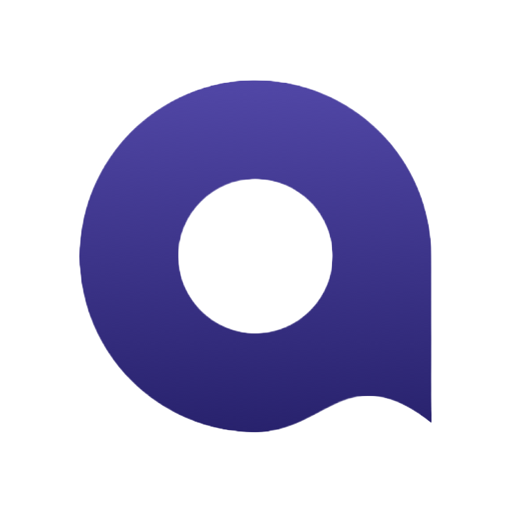

<h1 align="center">	&#10071 Cases &#10071</h1>

<h2>&#128187 In this repository you can find some of my manual tester projects</h2>

<h2><a href="https://github.com/evgenfromgus/Automation-Python"> &#129302 Automated testing projects are here</a></h2>

<h1 align="center">	&#10071 Project's description &#10071</h1>

1. ### **Mobile App (Skyeng) Testing**

<ins>About:</ins> 
Product - Skyeng mobile application. 
Sections: “Situations”, “Video practice”. 

<ins>Description:</ins> 
Familiarize yourself with the requirements of the sections. Make checklists for them. 
Write an informed choice of testing environment. Check the mobile application according to the documentation and change requests.Compile a test report. 

<ins>Target:</ins> 
Provide information about the possibility of full use of the functionality
sections “Situations” and “Video Practice”.

<ins>Testing types:</ins>  
- Documentation testing;
- Testing for compliance with layouts (GUI);
- Smoke testing;
- Functional and research;
- Testing interrupts;
- Usability testing;
- Testing localization and globalization.

<ins>Tools:</ins> 

 
 

 
 

2. ### **Project (web+api)**

<ins>About:</ins> 
Product - Skyeng web application. 
Sections: Teacher's personal account schedule. 

<ins>Description:</ins> 
A new functionality has been added to the teachers' schedule - personal events. 
It is necessary to test the backend based on a functional checklist for personal events. 
For testing, the collection of requests in Postman was compiled.

<ins>Target:</ins> 
Test the backend based on a functional checklist for personal events.

<ins>Testing types:</ins>  
- API testing.

<ins>Tools:</ins> 

 

 
 
 
 
 
 

3. ### **Testovoe**

<ins>About:</ins> 
Testing tasks using various tools. 

<ins>Description:</ins> 
A complete description of the tasks is located in the project folder. 
- Task 1 - Make a test plan and write a checklist for the Yandex mobile app Metro". 
- Task 2 - Create a collection of requests in Postman for GitHub API issues. 
- Task 3 - Create a checklist for collection requests from task 2. 
- Task 4 - Write 3 SQL queries on 2 tables. 
- Task 5 - Write E2E cases to be tested based on the state and transition diagram.
- Task 6 - Answer the questions.

<ins>Target:</ins> 
Solve all tasks with a minimum of errors.

<ins>Tools:</ins> 

 
 

 

4. ### **VK-API Wall**

<ins>About:</ins> 
Product - VK web application. 
Sections: Wall on home page. 

<ins>Description:</ins> 
Solve the issue with authorization access for the collection of overgrowths. 
Understand how to generate requests for the backend to add a picture to the wall.

<ins>Target:</ins> 
Create a collection of requests in Postman to upload posts with a picture to the wall. 
Compile a complete manual for working with the collection.

<ins>Testing types:</ins>  
- API testing.

<ins>Tools:</ins> 

 
 

5. ### **Сheck-list, test case**

<ins>About:</ins> 
Test cases and checklists not included in projects. 

<ins>Tools:</ins> 

